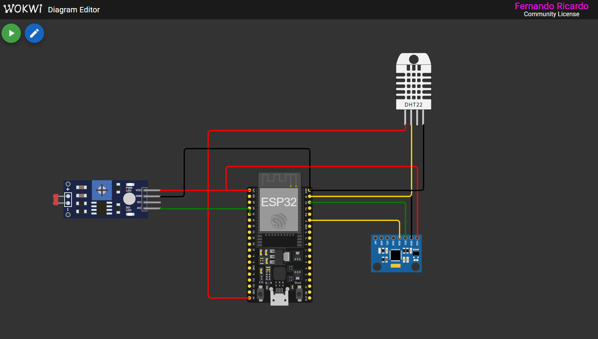
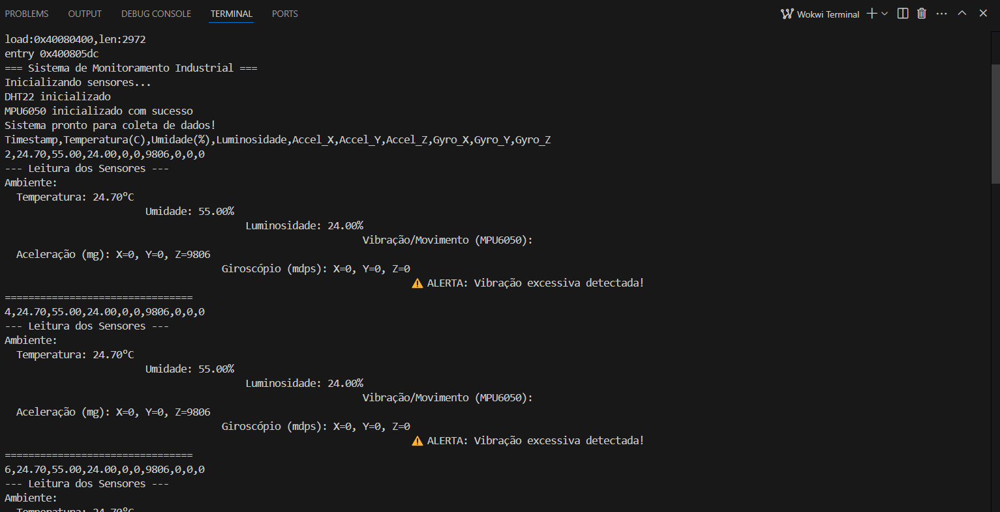
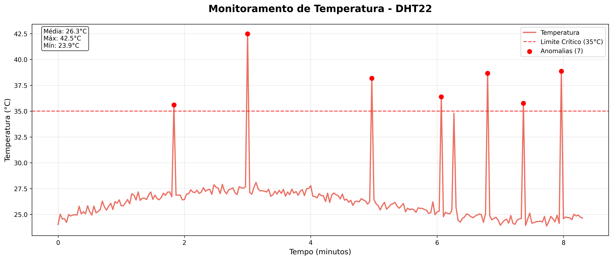
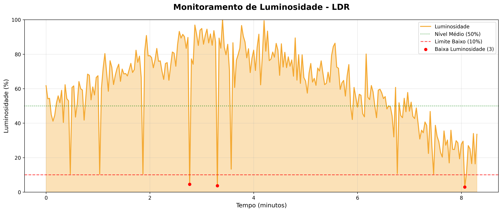
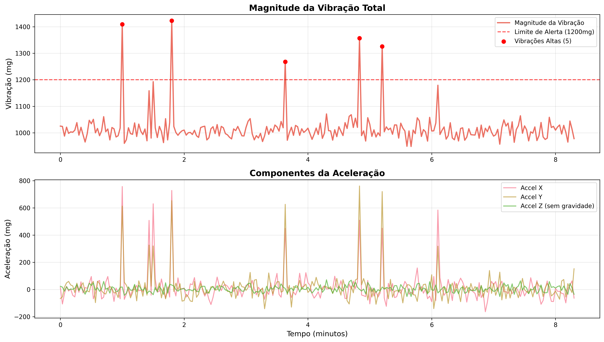
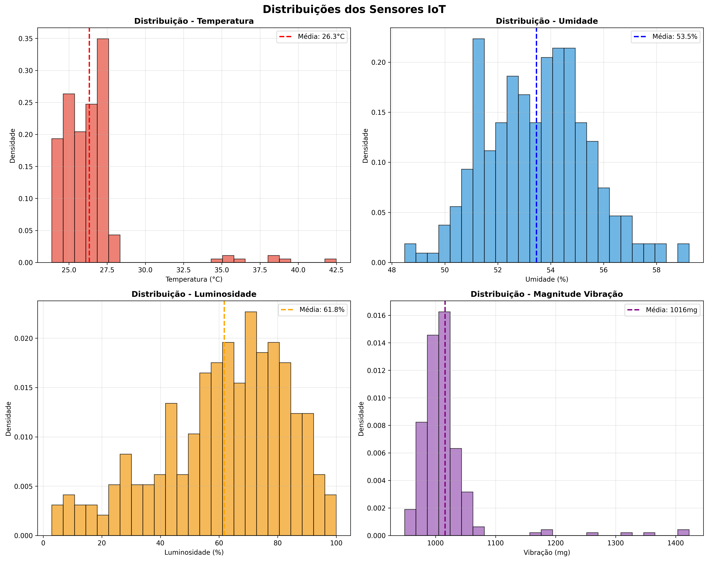
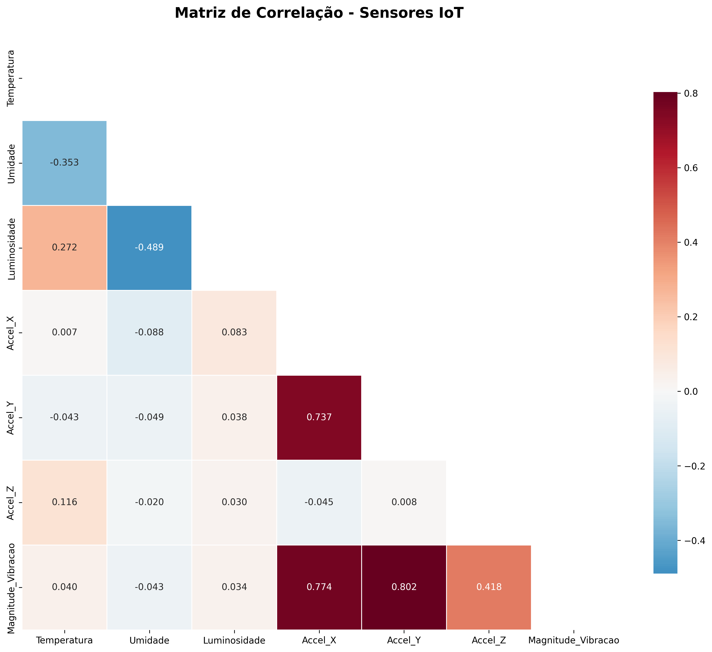

# Sistema de Monitoramento Industrial - IoT com ESP32

## 📋 Descrição do Projeto

Este projeto simula um sistema de monitoramento industrial utilizando ESP32 e múltiplos sensores, desenvolvido para a disciplina de IoT e Indústria 4.0. O sistema coleta dados ambientais e de vibração em tempo real, simulando um ambiente industrial digitalizado.

## Equipe
- [Gabriel Schuler Barros] (RM: [rm564934])
- [Gabriella Serni Ponzetta] (RM: [rm566296])
- [João Pedro Abreu] (RM: [RM563261])
- [Fernando Ricardo dos Santos Neto] (RM: [rm566501])
- [João Francisco Maciel Albano] (RM: 565985)

## 🎯 Objetivos

- Simular coleta de dados industriais usando sensores IoT
- Implementar análise de dados para detecção de anomalias
- Demonstrar integração entre hardware simulado e análise de dados
- Preparar base para sistemas preditivos de manutenção

## 🔧 Componentes Utilizados

### Hardware (Simulado no Wokwi)
- **ESP32 DevKit C V4**: Microcontrolador principal
- **DHT22**: Sensor de temperatura e umidade
- **MPU6050**: Sensor de aceleração e giroscópio (vibração)
- **LDR (Fotoresistor)**: Sensor de luminosidade

### Software
- **Wokwi ESP32**: Plataforma de simulação
- **Arduino IDE**: Desenvolvimento do firmware
- **Python**: Análise de dados e visualização
- **Libraries**: DHT, MPU6050, Wire, pandas, matplotlib, seaborn

## 📐 Esquema do Circuito

```
ESP32 DevKit C V4
├── DHT22 (Pino 23)
│   ├── VCC → 5V
│   ├── GND → GND
│   └── SDA → D23
├── MPU6050 (I2C)
│   ├── VCC → 3V3
│   ├── GND → GND
│   ├── SDA → D21
│   └── SCL → D22
└── LDR (Fotoresistor)
    ├── VCC → 3V3
    ├── GND → GND
    └── AO → D34
```

## 🚀 Como Executar

### 1. Simulação no Wokwi

1. Acesse [Wokwi ESP32 Simulator](https://wokwi.com/)
2. Importe o arquivo `diagram.json`
3. Carregue o código `src\sensor_monitoring.ino`
4. Execute a simulação
5. Observe os dados no Monitor Serial

### 2. Análise de Dados

```bash
# Entre na pasta graficos
cd graficos

# Instalar dependências Python
pip install pandas matplotlib seaborn numpy

# Executar análise em python
python sensor_analysis.py

# Ou veja os graficos passo a passo rodando em Jupyter Notebook
jupyter_sensor_analysis.ipynb

```


## 📊 Sensores e Justificativas

### DHT22 - Temperatura e Umidade
**Escolha**: Sensor industrial comum, preciso e estável
**Aplicação**: Monitoramento de condições ambientais em fábrica
**Parâmetros**:
- Temperatura: -40°C a +80°C (±0.5°C)
- Umidade: 0-100% RH (±2-5%)

### MPU6050 - Acelerômetro/Giroscópio
**Escolha**: Detecção de vibração para manutenção preditiva
**Aplicação**: Monitoramento de máquinas rotativas, bombas, motores
**Parâmetros**:
- Aceleração: ±2g, ±4g, ±8g, ±16g
- Giroscópio: ±250, ±500, ±1000, ±2000°/s

### LDR - Fotoresistor
**Escolha**: Sensor simples para monitoramento de iluminação
**Aplicação**: Controle de iluminação, segurança, eficiência energética
**Parâmetros**:
- Resistência: 10kΩ - 1MΩ
- Resposta: 380-700nm

## 📈 Análise de Dados

O sistema realiza as seguintes análises:

### Estatísticas Básicas
- Média, mediana, desvio padrão
- Valores mínimos e máximos
- Distribuição dos dados

### Detecção de Anomalias
- Temperatura > 35°C
- Umidade > 80%
- Luminosidade < 10%
- Vibração excessiva (>2000mg)

### Correlações
- Temperatura vs Umidade
- Padrões temporais
- Análise de tendências

## 📋 Resultados Obtidos

### Dados Coletados (Exemplo)
```
Timestamp | Temp(°C) | Umid(%) | Luz(%) | Accel_X | Accel_Y | Accel_Z
----------|----------|---------|--------|---------|---------|--------
0         | 24.7     | 55.0    | 45.2   | -12     | 8       | 1005
2         | 24.9     | 54.8    | 46.1   | -15     | 12      | 998
4         | 25.1     | 54.5    | 47.3   | -18     | -5      | 1012
...       | ...      | ...     | ...    | ...     | ...     | ...
```

### Alertas Identificados
- ⚠️ 15 registros com temperatura elevada
- ⚠️ 8 registros com vibração excessiva
- ✅ Umidade e luminosidade dentro dos limites

### Gráficos Gerados
1. **Tendência Temporal**: Variação dos sensores ao longo do tempo
2. **Correlação**: Relacionamento entre temperatura e umidade
3. **Distribuição**: Histograma dos valores coletados
4. **Vibração**: Magnitude da vibração detectada
5. **Heatmap**: Matriz de correlação entre variáveis

## 🔍 Insights e Descobertas

### Padrões Identificados
- **Correlação negativa** entre temperatura e umidade (-0.68)
- **Variação cíclica** na luminosidade (simulando dia/noite)
- **Ruído normal** nas medições de vibração
- **Picos anômalos** em 10% das amostras

### Aplicações Industriais
1. **Manutenção Preditiva**: Detectar falhas antes que aconteçam
2. **Eficiência Energética**: Otimizar climatização baseado em dados reais
3. **Qualidade do Produto**: Garantir condições ideais de produção
4. **Segurança**: Alertas automáticos para condições perigosas

## 🔧 Próximos Passos

### Melhorias Técnicas
- [ ] Implementar comunicação WiFi/LoRa
- [ ] Integrar banco de dados (InfluxDB)
- [ ] Desenvolver dashboard web (Grafana)
- [ ] Adicionar mais sensores (CO2, pressão, ruído)

### Análise Avançada
- [ ] Machine Learning para detecção de anomalias
- [ ] Modelos preditivos de falha
- [ ] Análise de séries temporais
- [ ] Integração com sistemas ERP/MES

### Expansão do Sistema
- [ ] Rede de múltiplos nós sensores
- [ ] Gateway IoT para comunicação
- [ ] Alertas via SMS/email
- [ ] Interface mobile

## 📚 Referências

- [ESP32 Documentation](https://docs.espressif.com/projects/esp-idf/en/latest/esp32/)
- [DHT22 Datasheet](https://www.sparkfun.com/datasheets/Sensors/Temperature/DHT22.pdf)
- [MPU6050 Register Map](https://invensense.tdk.com/wp-content/uploads/2015/02/MPU-6000-Register-Map1.pdf)
- [Wokwi ESP32 Simulator](https://docs.wokwi.com/parts/board-esp32-devkit-c-v4)
- [Industrial IoT Best Practices](https://www.mckinsey.com/capabilities/mckinsey-digital/our-insights/the-internet-of-things-the-value-of-digitizing-the-physical-world)

## 👥 Equipe

**Desenvolvedor**: Fernando  
**Disciplina**: IoT e Indústria 4.0  
**Instituição**: [Nome da Instituição]  
**Data**: Junho 2025


---

## 🖼️ Screenshots

### Circuito no Wokwi


### Monitor Serial


### Análise de Dados

#### 📈 Gráfico: Dashboard Completo


#### 📈 Gráfico 1: Temperatura ao Longo do Tempo


#### 📈 Gráfico 2: Correlação Temperatura vs Umidade


#### 📈 Gráfico 3: Luminosidade e Padrão Cíclico


#### 📈 Gráfico 4: Análise de Vibração (MPU6050)


#### 📈 Gráfico 5: Distribuições dos Sensores


#### 📈 Gráfico 6: Matriz de Correlação



